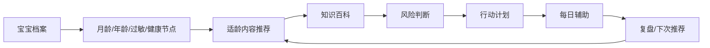

# 育儿百科完整知识体系

> 本文档用于定义育儿百科的内容分类、知识点、关联关系与内容模型。后续数据库一级分类表、Markdown 知识库、后台 CMS、搜索推荐和产品信息架构均以本文档为基线。
>
> 结论：一级领域固定为 12 个，覆盖 0-7 岁育儿百科主干。以后用户搜索任何育儿问题，应先落到这 12 个一级领域之一，再进入子领域、百科条目、行动计划或健康节点。

## 0. 调研依据

### 0.1 国内产品公开信息

| 产品 | 公开信息中体现的内容范围 | 对本产品的启发 |
|---|---|---|
| 亲宝宝 | 成长记录、智能育儿助手、孕期指导、宝宝出生后育儿指导、在家早教视频、辅食食谱、故事儿歌、成长评估 | 证明“宝宝档案 + 早教 + 辅食 + 成长评估”是高频育儿主干，但本产品不强化相册/亲友共享 |
| 宝宝树孕育 | 0-7 岁科学育儿指南，涵盖喂养、早教、健康护理；成长记录含身高体重、疫苗接种、成长曲线；妈妈频道覆盖产后修复、情绪管理 | 支撑“喂养营养、早期启蒙、疾病护理、疫苗、妈妈健康”作为一级内容 |
| 丁香妈妈 | 孕育百科可查疾病、症状、药品；工具含喂奶、产检、生长曲线；课程覆盖孕产、儿科、营养、早教、健身、护肤；早教覆盖运动、语言、艺术、社交、智力 | 支撑“疾病与症状、用药安全、早期启蒙、妈妈健康、内容可信机制” |
| 妈妈网孕育 | 孕期记录、育儿记录、喂养记录、宝宝成长记录，医学内容仅供参考 | 支撑“记录类能力应服务知识推荐和健康节点”，不作为本产品主线 |
| 小红书/抖音 | 大量真实育儿问题、经验笔记、短视频种草、情绪表达和焦虑场景 | 适合做问题发现和用户语言参考，不应作为医学结论来源 |

### 0.2 权威知识框架

| 来源 | 可参考范围 |
|---|---|
| AAP HealthyChildren | 年龄阶段、疾病症状、安全、健康生活、家庭照护 |
| CDC Developmental Milestones | 2个月到5岁发育里程碑、发育预警、早期识别 |
| WHO Infant and Young Child Feeding | 母乳、辅食、婴幼儿营养原则 |
| CDC Infant and Toddler Nutrition | 婴幼儿喂养、营养、食品安全 |

### 0.3 使用原则

- 国内 App 用来参考产品组织方式和用户入口。
- 权威机构用来参考医学、发育、营养、安全等知识骨架。
- 小红书/抖音用来发现用户高频问法、焦虑点和真实场景，不作为知识结论依据。
- 对疾病、用药、急救、疫苗内容，必须展示风险信号、来源、审校状态和免责声明。

## 1. 所有内容领域和子领域

### 1.1 一级领域总表（可直接做数据库一级分类表）

| id | 一级领域 | 子领域举例 | 产品定位 | 优先级 |
|---|---|---|---|---|
| growth_development | 生长发育 | 身高体重、大运动、精细动作、语言发展、认知发展、社交情感 | 建立月龄/年龄发展地图 | P0 |
| feeding_nutrition | 喂养营养 | 母乳喂养、配方奶、辅食添加、营养素补充、挑食偏食、过敏饮食 | 解决吃什么、怎么吃、是否正常 | P0 |
| daily_care | 日常护理 | 洗澡、脐带护理、红臀、穿衣指南、出牙护理、如厕训练 | 高频照护问题的家庭处理 | P0 |
| sleep | 睡眠 | 新生儿睡眠、并觉、夜醒、入睡困难、睡眠安全、作息表 | 建立安全和规律睡眠 | P0 |
| disease_symptom | 疾病与症状 | 发烧、咳嗽、腹泻、湿疹、幼儿急疹、手足口、流感、便秘 | 症状急查和护理/就医判断 | P0 |
| medication_safety | 用药安全 | 退烧药、抗生素、益生菌、外用药、剂量计算、用药禁忌 | 用药边界与禁忌提醒 | P0 |
| vaccine | 疫苗 | 一类疫苗、二类疫苗、接种时间表、不良反应、自费疫苗选择 | 疫苗节点和接种前后管理 | P0 |
| early_education | 早期启蒙 | 绘本推荐、早教游戏、语言启蒙、音乐、感统训练、分月龄玩法 | 从知识到每日早教行动 | P1 |
| mental_health | 心理健康 | 分离焦虑、情绪管理、安全感建立、二胎关系、入园适应 | 行为情绪和家庭回应方式 | P1 |
| safety_first_aid | 安全与急救 | 居家安全、出行安全、异物卡喉、烫伤处理、跌倒处理、溺水急救 | 高风险场景预防和急救步骤 | P0 |
| maternal_health | 妈妈健康 | 产后恢复、哺乳期营养、产后抑郁、盆底肌修复、避孕 | 支撑主要照护者健康和哺乳 | P1 |
| special_needs | 特殊需求 | 早产儿、过敏体质、发育迟缓、自闭症早期识别 | 特殊儿童和高风险家庭路径 | P1 |

### 1.2 二级子领域展开

#### 生长发育

- 身高体重：生长曲线、体重增长、身高增长、头围、BMI、儿保数据解读。
- 大运动：抬头、翻身、独坐、爬行、扶站、独走、跑跳、平衡。
- 精细动作：抓握、换手、捏取、拍手、搭积木、涂鸦、剪贴、书写准备。
- 语言发展：咿呀、指物、听懂指令、单词、短句、表达、双语环境。
- 认知发展：物体恒存、因果、分类、颜色形状、数量、注意力、记忆。
- 社交情感：依恋、陌生人焦虑、模仿、分享、合作、规则意识。

#### 喂养营养

- 母乳喂养：含接、奶量判断、追奶、堵奶、乳头混淆、断奶。
- 配方奶：冲调、奶量、换奶、吐奶、奶粉过敏、乳糖不耐受。
- 辅食添加：添加时机、食材顺序、富铁食物、质地进阶、手指食物。
- 营养素补充：维生素 D、铁、钙、DHA、锌、膳食纤维。
- 挑食偏食：拒食、追喂、零食、餐椅、家庭餐、自主进食。
- 过敏饮食：常见过敏原、观察窗口、回避、复食、严重过敏信号。

#### 日常护理

- 洗澡：频率、水温、洗护用品、湿疹宝宝洗澡。
- 脐带护理：新生儿脐带干燥、渗血、感染信号。
- 红臀：换尿布、清洁、护臀霜、尿布疹风险。
- 穿衣指南：冷热判断、睡袋、季节、户外穿衣。
- 出牙护理：出牙信号、口腔清洁、磨牙用品、发热误区。
- 如厕训练：准备信号、坐便器、白天训练、倒退处理。

#### 睡眠

- 新生儿睡眠：睡眠时长、安全睡眠、昼夜节律。
- 并觉：白天小睡次数变化、清醒窗口、过困。
- 夜醒：夜奶、出牙、鼻塞、湿疹、睡眠倒退、安抚。
- 入睡困难：睡前流程、抱睡、奶睡、陪睡、睡前刺激。
- 睡眠安全：仰睡、床品、窒息风险、同房不同床。
- 作息表：分月龄作息、7天/14天调整计划。

#### 疾病与症状

- 发烧：体温、月龄、精神、饮水、尿量、退热、就医信号。
- 咳嗽：干咳、湿咳、喘憋、鼻后滴漏、用药边界。
- 腹泻：脱水、补液、血便、饮食、轮状病毒。
- 湿疹：保湿、激素药膏边界、过敏、感染。
- 幼儿急疹：高热、出疹、护理、识别。
- 手足口：皮疹、口腔疱疹、隔离、重症信号。
- 流感：高热、全身症状、抗病毒药、疫苗预防。
- 便秘：排便频率、性状、饮食、就医信号。

#### 用药安全

- 退烧药：对乙酰氨基酚、布洛芬、适用年龄、间隔、剂量。
- 抗生素：适应证、不要自行使用、疗程、过敏。
- 益生菌：适用场景、证据强弱、保存方式。
- 外用药：湿疹药膏、护臀、抗菌药膏、眼耳鼻用药。
- 剂量计算：体重、浓度、剂型、频次、最大剂量。
- 用药禁忌：年龄禁忌、重复成分、成人药、复方感冒药。

#### 疫苗

- 一类疫苗：国家免疫规划、免费接种、补种规则。
- 二类疫苗：自费疫苗、适用人群、选择建议。
- 接种时间表：按月龄和地区维护。
- 不良反应：发热、局部红肿、过敏、观察时间。
- 自费疫苗选择：流感、轮状、肺炎、手足口等场景。

#### 早期启蒙

- 绘本推荐：分龄、亲子共读、语言互动。
- 早教游戏：趴、爬、抓握、配对、分类、假装游戏。
- 语言启蒙：输入、回应、指认、扩展表达。
- 音乐：儿歌、节奏、动作、听觉启蒙。
- 感统训练：前庭、本体、触觉，避免夸大宣传。
- 分月龄玩法：每日 5-15 分钟任务。

#### 心理健康

- 分离焦虑：依恋、安全告别、入托入园。
- 情绪管理：命名情绪、接纳、边界、替代表达。
- 安全感建立：稳定回应、固定照护、家庭一致性。
- 二胎关系：嫉妒、退行、共同参与、单独陪伴。
- 入园适应：分离、作息、自理、老师沟通。

#### 安全与急救

- 居家安全：防跌落、防烫伤、防误食、防夹伤、防触电。
- 出行安全：安全座椅、推车、头盔、防走失、防晒。
- 异物卡喉：识别、海姆立克、何时急救。
- 烫伤处理：冲、脱、泡、盖、送，禁忌偏方。
- 跌倒处理：头部外伤观察、呕吐、嗜睡、意识变化。
- 溺水急救：预防、识别、呼救、心肺复苏提示。

#### 妈妈健康

- 产后恢复：恶露、伤口、腹直肌、运动恢复。
- 哺乳期营养：饮食、饮水、忌口误区、用药咨询。
- 产后抑郁：情绪筛查、求助信号、家庭支持。
- 盆底肌修复：漏尿、训练、评估、就医。
- 避孕：哺乳期避孕、短效/长效方式、复诊。

#### 特殊需求

- 早产儿：纠正月龄、喂养、发育随访、感染预防。
- 过敏体质：食物过敏、湿疹、哮喘风险、回避与复食。
- 发育迟缓：筛查、语言/运动/社交预警、转诊。
- 自闭症早期识别：眼神、回应、指物、共同注意、刻板行为。

## 2. 每个领域的核心知识点

### 生长发育

- 按月龄/年龄建立预期，不把所有孩子放在同一标准里比较。
- 看趋势和多维表现，不用单个动作判断发育异常。
- 发育预警要明确：倒退、多项落后、异常姿势、听视力反应异常。
- 与早期启蒙、儿保体检、特殊需求强关联。

### 喂养营养

- 0-6 月以奶和生长趋势为主。
- 6-12 月以辅食质地进阶、富铁食物、过敏观察为主。
- 1 岁后以家庭餐、自主进食、饮食结构和挑食处理为主。
- 喂养建议必须结合月龄、过敏史、身高体重趋势和当前症状。

### 日常护理

- 高频护理要给明确步骤和“不要做什么”。
- 护理内容与疾病症状、用药安全、安全急救之间要互相跳转。
- 如厕训练应从日常护理进入，也可生成行动计划。

### 睡眠

- 先排查身体不适和作息，再谈行为调整。
- 安全睡眠优先级高于睡眠训练。
- 睡眠计划要按月龄和家庭可执行程度分层。

### 疾病与症状

- 条目结构固定为：结论、先做什么、不要做什么、风险信号、相关计划、来源。
- 高风险信号必须醒目，不能藏在长文末尾。
- 搜索入口优先承接症状词和俗称。

### 用药安全

- 必须以体重、年龄、剂型、浓度和频次为结构化字段。
- 不做诊断，不鼓励用户自行用处方药。
- 与疾病症状条目强绑定，但独立成一级领域，便于搜索“某某药能不能吃”。

### 疫苗

- 疫苗内容要地区可配置。
- 一类/二类、自费选择、补种、不良反应都要结构化。
- 与宝宝档案的健康节点直接关联。

### 早期启蒙

- 早教内容以分龄能力发展为依据，不做焦虑式“开发智力”。
- 每个计划要有每日任务、材料、步骤、观察点和替代方案。
- 与生长发育领域强关联。

### 心理健康

- 行为问题要先解释发展阶段，再给家长回应脚本。
- 不把孩子标签化，不做恐吓式判断。
- 与入园适应、家庭教育、二胎关系强关联。

### 安全与急救

- 急救内容必须给立即行动步骤和禁忌。
- 安全内容可以生成家庭安全清单。
- 高风险场景应允许置顶和离线查看。

### 妈妈健康

- 妈妈健康影响照护质量和母乳喂养，应纳入体系。
- 产后抑郁和盆底肌问题需要明确求助路径。
- 不应喧宾夺主成为泛女性健康社区。

### 特殊需求

- 特殊需求不是“测评中心”，而是风险识别、随访和专业转介。
- 早产儿要用纠正月龄。
- 自闭症、发育迟缓内容必须谨慎表达，避免产品内确诊。

## 3. 内容之间的关联关系

### 3.1 主链路



### 3.2 搜索路由关系

| 用户搜索 | 一级领域 | 后续承接 |
|---|---|---|
| 8个月宝宝不会爬 | 生长发育 | 大运动百科、发育预警、早教运动计划 |
| 6个月第一口辅食 | 喂养营养 | 辅食百科、过敏观察、14天辅食计划 |
| 夜醒频繁 | 睡眠 | 夜醒排查、鼻塞/湿疹/出牙关联、睡眠计划 |
| 发烧 38.5 | 疾病与症状 | 发热急查、退烧药用药安全、发热护理计划 |
| 美林怎么吃 | 用药安全 | 布洛芬剂量、禁忌、发热百科 |
| 下次疫苗 | 疫苗 | 疫苗时间表、宝宝档案健康节点 |
| 今天玩什么 | 早期启蒙 | 分月龄早教计划、绘本/游戏任务 |
| 总是发脾气 | 心理健康 | 情绪管理百科、行为回应计划 |
| 烫伤怎么办 | 安全与急救 | 烫伤急救步骤、禁忌、就医信号 |
| 产后情绪不好 | 妈妈健康 | 产后抑郁识别、求助路径 |
| 早产宝宝怎么养 | 特殊需求 | 纠正月龄、喂养、发育随访 |

### 3.3 领域关联矩阵

| 源领域 | 关联领域 | 关系说明 |
|---|---|---|
| 生长发育 | 早期启蒙 | 发育里程碑决定早教任务 |
| 生长发育 | 疫苗 | 儿保体检包含发育筛查 |
| 喂养营养 | 生长发育 | 营养影响身高体重趋势 |
| 喂养营养 | 疾病与症状 | 过敏、腹泻、呕吐可能与食物相关 |
| 日常护理 | 疾病与症状 | 红臀、湿疹、出牙等护理问题可能变成症状问题 |
| 睡眠 | 疾病与症状 | 夜醒需排查鼻塞、湿疹、出牙、发热 |
| 疾病与症状 | 用药安全 | 症状详情关联可用/禁用药物 |
| 疾病与症状 | 安全与急救 | 异物、烫伤、跌倒属于急症入口 |
| 疫苗 | 宝宝档案 | 接种时间、完成状态、下次节点 |
| 早期启蒙 | 心理健康 | 社交、规则、情绪与早教任务交叉 |
| 心理健康 | 入园适应 | 分离焦虑、情绪管理、规则建立支持入园 |
| 妈妈健康 | 喂养营养 | 哺乳期营养和用药影响母乳喂养 |
| 特殊需求 | 生长发育 | 早产、迟缓、自闭症均需要发育筛查和随访 |

### 3.4 内容到计划映射

| 一级领域 | 可生成计划 |
|---|---|
| 生长发育 | 大运动练习计划、语言观察计划、发育随访计划 |
| 喂养营养 | 14天辅食推进、7天挑食改善、过敏观察计划 |
| 日常护理 | 如厕训练计划、红臀护理计划、出牙护理计划 |
| 睡眠 | 7天睡前流程、14天夜醒调整、并觉过渡计划 |
| 疾病与症状 | 发热3天观察、腹泻补液观察、咳嗽护理计划 |
| 用药安全 | 退烧药使用提醒、用药记录与复核清单 |
| 疫苗 | 接种前后2天计划、自费疫苗决策清单 |
| 早期启蒙 | 7天亲子互动、14天语言启蒙、14天感统游戏 |
| 心理健康 | 14天情绪回应、分离焦虑适应计划 |
| 安全与急救 | 居家安全排查清单、出行安全计划 |
| 妈妈健康 | 产后恢复计划、哺乳期营养计划、情绪求助计划 |
| 特殊需求 | 早产儿随访计划、发育迟缓观察与转介计划 |

## 4. 推荐的内容模型（字段结构）

### 4.1 一级分类表 `knowledge_domain`

```json
{
  "id": "disease_symptom",
  "name": "疾病与症状",
  "description": "发烧、咳嗽、腹泻、湿疹等症状急查与护理判断",
  "age_min_month": 0,
  "age_max_month": 84,
  "priority": "P0",
  "sort_order": 50,
  "status": "active"
}
```

### 4.2 二级分类表 `knowledge_subdomain`

```json
{
  "id": "symptom_fever",
  "domain_id": "disease_symptom",
  "name": "发烧",
  "aliases": ["发热", "体温高"],
  "description": "体温、精神、饮水、尿量、退热、就医信号",
  "sort_order": 10,
  "status": "active"
}
```

### 4.3 百科条目表 `knowledge_article`

```json
{
  "id": "article_fever_001",
  "domain_id": "disease_symptom",
  "subdomain_id": "symptom_fever",
  "title": "宝宝发烧怎么判断",
  "aliases": ["发热", "体温高", "38.5"],
  "age_min_month": 0,
  "age_max_month": 84,
  "summary": "体温只是一个指标，精神状态、呼吸、饮水和尿量同样重要。",
  "conclusion": ["3个月以下宝宝发热建议尽快咨询医生。"],
  "first_steps": ["记录体温、测量方式和时间。"],
  "dont_do": ["不要用酒精擦浴。"],
  "risk_signals": [
    { "level": "high", "text": "3个月以下发热", "action": "尽快就医或咨询医生" }
  ],
  "related_article_ids": ["article_med_antipyretic_001"],
  "related_plan_ids": ["plan_fever_care_3d"],
  "source_level": "expert_reviewed",
  "review_status": "draft",
  "updated_at": "2026-06-30"
}
```

### 4.4 行动计划表 `action_plan`

```json
{
  "id": "plan_early_language_14d",
  "domain_id": "early_education",
  "title": "14天语言启蒙计划",
  "age_min_month": 12,
  "age_max_month": 24,
  "duration_days": 14,
  "goal": "通过每日亲子互动增加语言输入和回应机会。",
  "preconditions": ["听力筛查无异常", "家长每天可投入10分钟"],
  "materials": ["绘本", "日常物品", "儿歌"],
  "risk_stop_signals": ["语言倒退", "对声音反应明显异常"],
  "status": "active"
}
```

### 4.5 行动计划任务表 `action_plan_task`

```json
{
  "id": "task_early_language_001",
  "plan_id": "plan_early_language_14d",
  "day_index": 1,
  "title": "指认家里的3个物品",
  "steps": ["选择杯子、球、鞋子", "家长先说名称", "等待宝宝看或指", "给予回应和扩展"],
  "estimated_minutes": 10,
  "success_criteria": "宝宝能看向或触碰至少1个物品",
  "fallback": "如果宝宝不配合，换成洗澡或吃饭场景中的物品"
}
```

### 4.6 宝宝档案表 `child_profile`

```json
{
  "id": "child_001",
  "nickname": "小宝",
  "birth_date": "2025-09-10",
  "sex": "boy",
  "city": "上海",
  "feeding_type": "mixed",
  "allergies": ["暂无"],
  "current_concerns": ["辅食", "夜醒", "疫苗"],
  "vaccine_done_count": 3,
  "checkup_done_count": 2,
  "next_health_node_id": "health_node_10m_checkup",
  "created_at": "2026-06-30",
  "updated_at": "2026-06-30"
}
```

### 4.7 健康节点表 `health_node`

```json
{
  "id": "health_node_10m_checkup",
  "child_id": "child_001",
  "type": "checkup",
  "title": "10月龄体检",
  "suggested_age_month": 10,
  "scheduled_date": "2026-07-16",
  "status": "upcoming",
  "preparation": ["带好儿保手册", "记录辅食和夜醒问题", "确认疫苗接种记录"],
  "related_article_ids": ["article_growth_10m", "article_feeding_10m"],
  "related_plan_ids": ["plan_solid_food_14d"]
}
```

### 4.8 用药安全表 `medication_guide`

```json
{
  "id": "med_acetaminophen",
  "domain_id": "medication_safety",
  "name": "对乙酰氨基酚",
  "common_names": ["泰诺林"],
  "age_limit": "按说明书和医生建议",
  "dose_basis": "weight",
  "warnings": ["避免与其他含同成分药物重复", "肝功能异常需咨询医生"],
  "related_symptom_ids": ["symptom_fever"],
  "review_status": "requires_medical_review"
}
```

### 4.9 来源表 `source_reference`

```json
{
  "id": "source_cdc_milestones",
  "title": "CDC Developmental Milestones",
  "url": "https://www.cdc.gov/ncbddd/actearly/milestones/index.html",
  "organization": "CDC",
  "source_type": "public_health_authority",
  "used_for_domain_ids": ["growth_development", "special_needs"],
  "retrieved_at": "2026-06-30"
}
```

### 4.10 推荐规则表 `recommendation_rule`

```json
{
  "id": "rule_feeding_7_9m",
  "trigger": {
    "age_month_min": 7,
    "age_month_max": 9,
    "concerns_any": ["辅食", "过敏", "体重增长"]
  },
  "recommend_article_ids": ["article_solid_food_order"],
  "recommend_plan_ids": ["plan_solid_food_14d"],
  "priority": 80,
  "cooldown_days": 7,
  "status": "active"
}
```

## 5. 产品完善原则

### 5.1 首页

- 去掉固定的“常见问题快速入口”。
- 首页只保留：搜索、宝宝档案摘要、今日推荐、继续计划、下次健康节点。
- 知识地图放到“知识库”Tab，作为完整分类入口。

### 5.2 宝宝个人信息

必须可填写，至少包括：昵称、出生日期、性别、城市、喂养方式、过敏史、当前关注、疫苗次数、儿保次数、下次健康节点。

### 5.3 计划体系

计划应从完整知识体系中生成，不只围绕当前症状。优先计划：

- 早教计划：语言启蒙、亲子互动、大运动、感统游戏。
- 疫苗计划：接种前准备、接种后观察、自费疫苗决策。
- 喂养计划：辅食推进、挑食改善、过敏观察。
- 睡眠计划：睡前流程、夜醒调整、并觉过渡。
- 安全计划：居家安全排查、出行安全。

## 6. 参考来源

- 亲宝宝 App Store：`https://apps.apple.com/cn/app/id672984826`
- 宝宝树孕育 App Store：`https://apps.apple.com/cn/app/id523063187`
- 丁香妈妈 App Store：`https://apps.apple.com/cn/app/id1401783711`
- 妈妈网孕育 App Store：`https://apps.apple.com/cn/app/id881419775`
- AAP HealthyChildren Ages & Stages：`https://www.healthychildren.org/English/ages-stages/Pages/default.aspx`
- CDC Developmental Milestones：`https://www.cdc.gov/ncbddd/actearly/milestones/index.html`
- WHO Infant and Young Child Feeding：`https://www.who.int/news-room/fact-sheets/detail/infant-and-young-child-feeding`
- CDC Infant and Toddler Nutrition：`https://www.cdc.gov/infant-toddler-nutrition/`