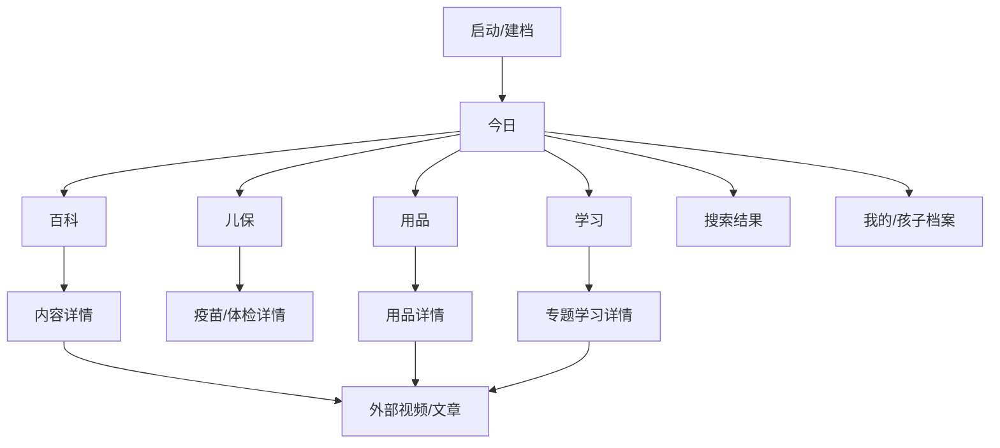

# 养育地图：墨刀线框设计稿

## 0. 设计目标

产品定位：面向中国大陆 0-5 岁家庭的分龄育儿百科和家庭执行工具。

设计关键词：

- 专业冷静：像儿保手册和专业工具，不像信息流社区。
- 首页简单：用户第一眼只看到“我家孩子现在该注意什么”。
- 可持续深入：从今日任务进入百科、儿保、用品、学习专题。
- 图文视频结合：每篇内容都有图片、步骤、风险提示和外部学习链接。
- 后续可开发：所有页面都映射到数据对象和接口。

## 1. 信息架构

底部导航：

- 今日
- 百科
- 儿保
- 用品
- 学习

不建议第一版放社区入口。社区容易带来焦虑、争论和内容审核成本。

## 2. 全局组件

### 2.1 顶部栏

- 左侧：产品名或当前页面标题。
- 右侧：孩子昵称/切换孩子。
- 页面内返回：左上角返回箭头，保持系统级返回一致。

### 2.2 孩子信息卡

字段：

- 昵称
- 出生日期
- 性别
- 城市
- 喂养方式
- 早产/过敏选填

交互：

- 出生日期改变后，立即重新计算月龄。
- 城市改变后，疫苗/儿保页面切换本地提示。
- 性别暂不影响医学建议，只用于档案和称呼，避免无依据的性别化推荐。

### 2.3 内容卡

固定结构：

- 主题标签
- 标题
- 适用年龄
- 30 秒结论
- 图文入口
- 风险提示

### 2.4 三层内容组件

Tabs：

- 30秒
- 3分钟
- 深入

说明：

- 30秒：一句话结论和立即能做。
- 3分钟：图文步骤、常见错误。
- 深入：视频、权威文章、书籍参考、专家解读。

### 2.5 风险提示组件

用于：

- 发烧、腹泻、误食、摔伤、呼吸困难。
- 疫苗接种禁忌和延迟。
- 睡眠安全。
- 安全座椅/提篮使用。

样式：

- 浅红或浅橙背景。
- 标题为“需要咨询医生”或“高风险提醒”。
- 不使用恐吓语气。

## 3. 页面线框

### 3.1 启动/建档页

目标：让系统知道孩子年龄和城市。

模块：

1. 产品名：养育地图
2. 一句话说明：按孩子月龄生成今日重点和育儿百科
3. 表单：
   - 孩子昵称
   - 出生日期
   - 性别
   - 常住城市
   - 喂养方式
4. 主按钮：进入今日
5. 次按钮：先随便看看

状态：

- 空状态：出生日期未填时不能生成精准推荐。
- 错误：出生日期不能晚于今天。
- 跳过：进入百科总览，顶部提示“补充孩子信息后推荐更准”。

### 3.2 今日页

目标：让家长一眼知道今天该关注什么。

模块顺序：

1. 孩子信息摘要
   - 昵称
   - 月龄
   - 性别
   - 城市
2. 搜索框
   - 占位：今天遇到什么育儿问题？
3. 今日 3 件事
   - 喂养/睡眠/安全/发育按月龄变化
4. 主题入口宫格
   - 喂养、睡眠、健康、发育、教育、行为、用品、出行、安全、入园、儿保、父母支持
5. 当前月龄推荐卡
6. 最近收藏/最近学习

关键交互：

- 改出生日期：今日 3 件事和推荐卡实时变化。
- 搜索“尿不湿”：跳到用品。
- 搜索“哄睡”：跳到睡眠。
- 搜索“疫苗”：跳到儿保。

### 3.3 百科页

目标：承载全量知识，但入口不吓人。

模块：

1. 年龄分段 Tabs
   - 0-6月
   - 7-12月
   - 1-2岁
   - 2-3岁
   - 3-5岁
2. 主题地图
   - 喂养营养
   - 健康护理
   - 睡眠作息
   - 发育教育
   - 行为情绪
   - 家庭安全
   - 入园准备
   - 父母支持
3. 高频问题
4. 内容列表

筛选：

- 年龄
- 主题
- 内容形态：图文、视频、清单、风险分级、对话模板

### 3.4 内容详情页

目标：让用户看得懂、记得住、能执行。

模块：

1. 标题
2. 适用年龄
3. 封面图
4. 30秒结论
5. 3分钟步骤
6. 常见误区
7. 需要警惕
8. 延伸学习
9. 相关问题

内容模板：

- 结论不超过 3 条。
- 每个步骤都写成动作，而不是抽象知识。
- 医疗内容必须带风险提示。
- 外部链接标注来源和内容类型。

### 3.5 儿保页

目标：把疫苗、体检、儿保节点变成家庭提醒。

模块：

1. 城市选择
2. 当前月龄节点
3. 时间轴
   - 出生
   - 1月龄
   - 2-4月龄
   - 6月龄
   - 8月龄
   - 12月龄
   - 18月龄
   - 2岁
   - 3岁
   - 4-5岁
4. 接种记录
5. 儿保记录
6. 本地门诊提示

状态：

- 已完成
- 当前待办
- 延迟
- 不适合接种，需咨询医生

### 3.6 用品页

目标：解决“要不要买、怎么买、怎么用”的家庭问题。

分类：

- 出行：安全座椅、提篮、推车、腰凳。
- 喂养：奶瓶、奶嘴、餐椅、餐具、辅食工具。
- 护理：尿不湿、拉拉裤、湿巾、护臀膏、洗护。
- 睡眠：婴儿床、睡袋、床垫、安抚物。
- 家居安全：围栏、插座保护、柜锁、防撞条。

用品详情字段：

- 必要程度：必要/可选/不建议。
- 适用年龄。
- 怎么选。
- 怎么用。
- 常见错误。
- 品牌比较维度。
- 视频链接。
- 风险提示。

品牌比较原则：

- 不说“最好”。
- 只给维度：尺码、材质、适用体重、渠道、价格、用户反馈。
- 允许用户保存自己的试用记录。

### 3.7 睡眠哄睡页

目标：按月龄给家长可执行的哄睡方案。

模块：

1. 当前月龄睡眠重点
2. 睡前流程模板
3. 夜醒处理
4. 抱睡转床
5. 睡眠安全
6. 需要就医的睡眠信号

内容例子：

- 0-6月：安全睡眠、昼夜节律、哭闹排查。
- 7-12月：固定流程、分离焦虑、夜醒低刺激安抚。
- 1-2岁：午睡安排、睡前边界。
- 2-3岁：拖延入睡、怕黑、噩梦。
- 3-5岁：屏幕时间、入园作息、打鼾风险。

### 3.8 学习页

目标：让用户系统学习，而不是被动刷文章。

专题：

- 母乳与奶瓶
- 辅食到自主进食
- 发烧腹泻家庭护理
- 睡眠和哄睡
- 情绪和规则
- 亲子阅读
- 入园准备
- 家庭安全

每个专题结构：

- 课程地图
- 图文卡
- 视频链接
- 对话模板
- 记忆卡
- 家庭待办

## 4. 墨刀页面命名建议

- 00_启动建档
- 01_今日
- 02_百科总览
- 03_内容详情_辅食
- 04_儿保疫苗
- 05_用品总览
- 06_用品详情_安全座椅
- 07_用品详情_尿不湿
- 08_睡眠哄睡
- 09_学习路径
- 10_我的档案
- 11_搜索结果
- 12_空状态和错误状态

## 5. 交互连线

- 启动建档 -> 今日
- 今日搜索 -> 搜索结果
- 搜索结果 -> 内容详情/用品详情/儿保
- 今日主题入口 -> 对应一级页
- 百科卡片 -> 内容详情
- 儿保时间轴 -> 疫苗/体检详情
- 用品卡片 -> 用品详情
- 学习专题 -> 专题详情
- 所有详情页 -> 收藏
- 收藏 -> 我的

## 6. 视觉规范

画布：

- 移动端主画布：390 x 844。
- 安全区：顶部 44，底部 34。
- 页面左右边距：16。
- 卡片圆角：12-16。
- 字号：
  - 页面标题：22-24。
  - 模块标题：17-18。
  - 正文：14-15。
  - 注释：12-13。

颜色：

- 背景：接近白的暖灰。
- 主色：低饱和绿色。
- 辅助色：浅蓝、浅黄。
- 风险色：浅橙/浅红。
- 文字：深绿黑，不用纯黑大面积压迫。

风格：

- 不做卡通化。
- 不用大面积渐变。
- 不做社区信息流。
- 图片要真实生活化，避免过度摆拍。

## 7. 开发映射

页面到接口：

- 今日页：`GET /api/today?childId=demo`
- 百科页：`GET /api/articles?ageMonth=&topic=`
- 内容详情：`GET /api/articles/:id`
- 儿保页：`GET /api/care-schedule?childId=demo&city=上海`
- 用品页：`GET /api/products?category=`
- 搜索：`GET /api/search?q=`
- 孩子档案：`GET /api/children/demo`，`PUT /api/children/demo`

核心数据：

- ChildProfile
- StageRecommendation
- KnowledgeArticle
- CareSchedule
- ProductGuide
- LearningPath
- ExternalResource
